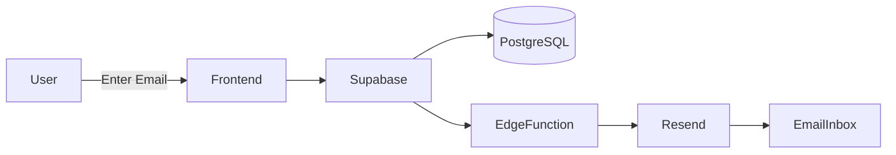

<!-- ===================================================== -->
<!--                AETHERON ANIMATED README               -->
<!-- ===================================================== -->

---

---

---

## ⚡ About The Project

> **AETHERON** is a futuristic anime RPG launch landing page built to simulate a real AAA game announcement website.

✨ Smooth Animations  
✨ Neon Cyberpunk Interface  
✨ Real Backend Integration  
✨ Production-Ready Structure  

---

## 🧠 Core Features

- 🎮 Game-style Landing Experience  
- ✨ Framer Motion Animations  
- ⚡ Particle Background Engine  
- 📨 Pre-Registration System  
- ⏳ Live Countdown System  
- 🌌 Modern Gaming UI  
- 📱 Fully Responsive  

---

## 🧩 Tech Stack

---

## 🖼️ Live Preview

---

## ⚙️ System Flow

🎮 Interactive Experience

  

🧠 Engineering Highlights
<table> <tr> <td width="50%">
🚀 Frontend

React + Vite Architecture

Motion Driven UI

Component Based Design

Particle Background Engine

GPU Friendly Animations

</td> <td width="50%">
⚡ Backend

Supabase PostgreSQL

Edge Functions

Email Automation

Secure API Calls

Production Ready Structure

</td> </tr> </table>

👩‍💻 Developer

 

CSE Student • VIT
Frontend Engineer • UI Designer • Builder

 

⭐ Support The Project

If you like this project, consider giving it a ⭐ on GitHub!

   

  

